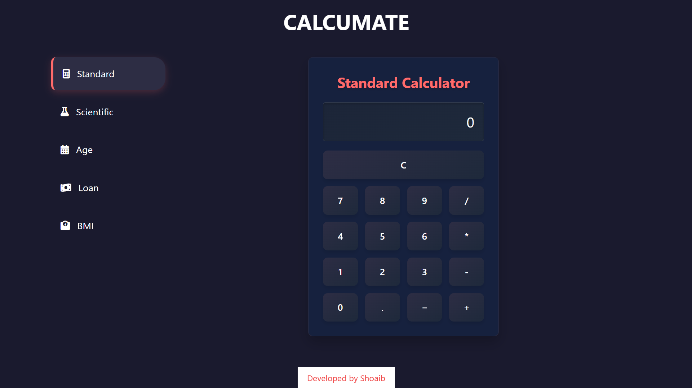

# 🔢 CALCUMATE - Multi-functional Calculator

**CalcuMate** is a powerful and modern calculator app built with **React**, supporting standard and scientific calculations, age, loan, and BMI computations — all in one sleek interface.

---

## ✨ Features

- 🧮 **Standard Calculator**  
- 📐 **Scientific Calculator** with advanced mathematical functions  
- 🎉 **Age Calculator** to compute age from birthdate  
- 💰 **Loan Calculator** with Indian currency support  
- ⚖️ **BMI Calculator** with health categorization  
- ⌨️ **Keyboard Support** for fast input  
- 📱 **Responsive Design** for all screen sizes  

---

## 🌐 Live Demo

👉 [Click here to try CalcuMate](https://your-github-username.github.io/guru-calcu)

---

## 🖼️ Preview

---

## 👨‍💻 Created By

Developed with 💙 by **Shoaib**

---

## 🛠️ Technologies Used

- ⚛️ **React 18**  
- 🎨 **TailwindCSS**  
- ⭐ **Font Awesome**  
